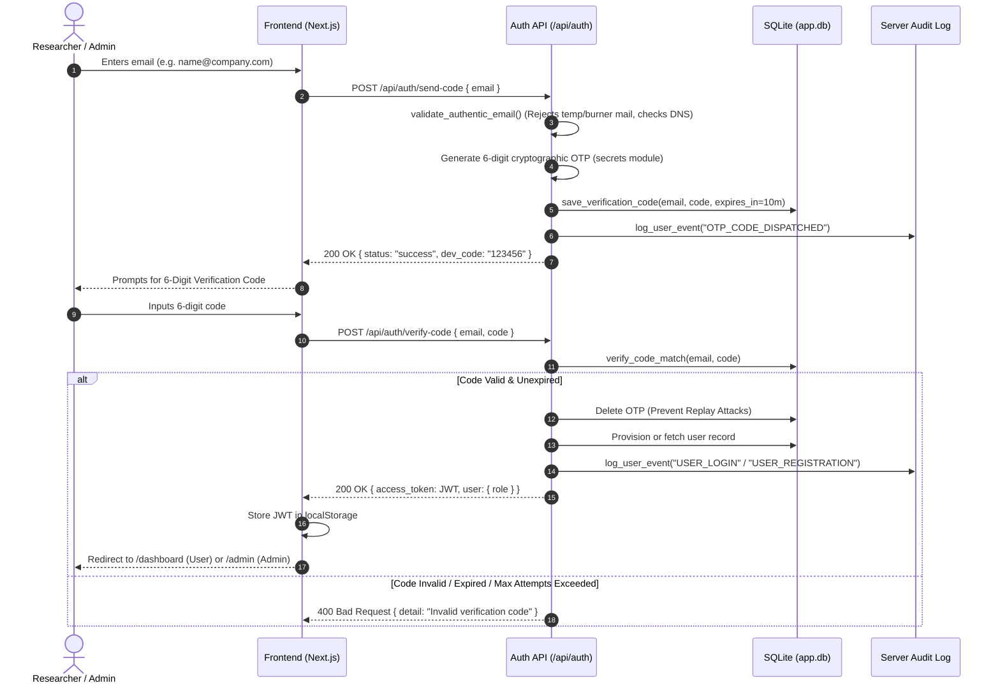
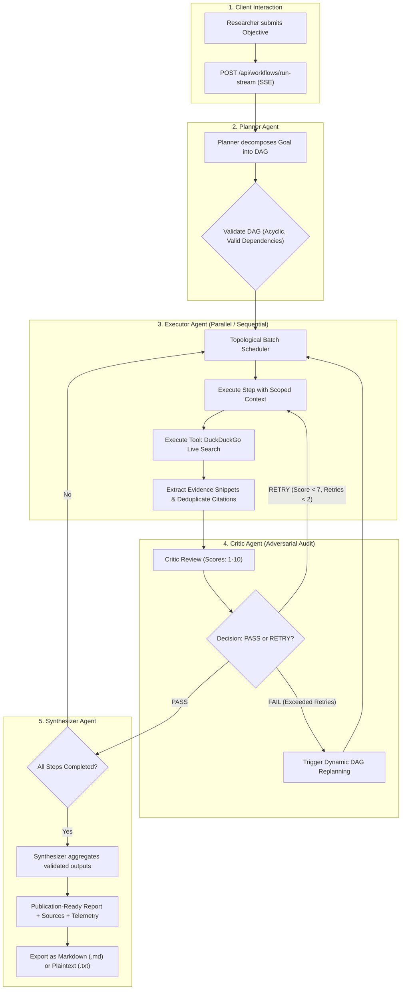

# TriadFlow: Multi-Agent Architecture & Engineering Reference

> **An Autonomous Planner–Executor–Critic Multi-Agent Research System**
> Production-grade, deterministic, and verifiable multi-agent framework built with FastAPI, Next.js 16, SQLite, and Google Gemini.

---

## 1. System Entry Points

When inspecting or running the TriadFlow application, start at the following explicit entry points:

| Layer | Entry File | Protocol / Port | Purpose |
| :--- | :--- | :--- | :--- |
| **Backend API** | [`src/api/main.py`](file:///c:/Users/Ashuu/Documents/Sem%205/Projects/OJTProject/src/api/main.py) | HTTP / Port `8000` | FastAPI server entry point, CORS middleware, router registration, OpenAPI/Swagger docs (`/docs`). |
| **Frontend Web** | [`frontend/src/app/page.tsx`](file:///c:/Users/Ashuu/Documents/Sem%205/Projects/OJTProject/frontend/src/app/page.tsx) | HTTP / Port `3000` | Next.js 16 App Router landing page, feature highlights, and authentication links. |
| **Agent Triad Orchestrator** | [`src/orchestrator/engine.py`](file:///c:/Users/Ashuu/Documents/Sem%205/Projects/OJTProject/src/orchestrator/engine.py) | Python Engine | Core multi-agent state machine managing DAG execution, batching, critic evaluation, and bounded self-correction. |
| **Researcher Dashboard** | [`frontend/src/app/dashboard/page.tsx`](file:///c:/Users/Ashuu/Documents/Sem%205/Projects/OJTProject/frontend/src/app/dashboard/page.tsx) | Browser View | Core research interface with real-time SSE streaming, 4-stage stepper, live citations drawer, and report export. |
| **Admin Governance Console** | [`frontend/src/app/admin/page.tsx`](file:///c:/Users/Ashuu/Documents/Sem%205/Projects/OJTProject/frontend/src/app/admin/page.tsx) | Browser View | Administrative dashboard for user registries, cross-company workflows, token expenditure telemetry, and live server audit logs. |

---

## 2. Directory Layout & Architecture Map

```text
OJTProject/
├── ARCHITECTURE.md                  # Comprehensive architectural guide & engineering reference (This document)
├── README.md                        # Project quickstart, installation, and deployment guide
├── app.db                           # SQLite persistent database (Users, Workflows, OTP Codes)
├── logs/                            # Production server logs directory
│   ├── user_activity.log            # Human-readable timestamped server security audit trail
│   └── user_workflows.jsonl         # Machine-readable structured JSONL logs for analytics/SIEM
│
├── src/                             # Core Backend Python Source Code
│   ├── agents/                      # Multi-Agent Triad implementations
│   │   ├── planner.py               # Planner Agent: Decomposes goal into structured DAG
│   │   ├── executor.py              # Executor Agent: Runs steps, searches web, grounds evidence
│   │   ├── critic.py                # Critic Agent: Adversarial evaluation (correctness, completeness, relevance)
│   │   └── synthesizer.py           # Synthesizer Agent: Generates final executive report with citations
│   │
│   ├── orchestrator/                # Orchestration & Scheduling Engine
│   │   └── engine.py                # OrchestrationEngine: Coordinates Planner-Executor-Critic lifecycle & recovery loops
│   │
│   ├── tools/                       # Agent Execution Tools
│   │   └── search.py                # Live Web Search tool via DuckDuckGo with strict URL deduplication
│   │
│   ├── llm/                         # LLM Gateway & Provider Abstraction
│   │   └── gateway.py               # Google Gemini integration (gemini-flash-lite-latest) with fallback cascade
│   │
│   ├── models/                      # Pydantic Schemas & Data Contracts
│   │   └── schemas.py               # WorkflowState, Plan, Step, CriticReview, SourceCitation models
│   │
│   └── api/                         # FastAPI REST & SSE Streaming API
│       ├── main.py                  # API Entry point: Application bootstrap, CORS, routers
│       ├── auth.py                  # Passwordless OTP auth, email authenticity validation, JWT issuance
│       ├── database.py              # SQLite data access layer: Users, Workflows, OTP verification codes
│       ├── audit_logger.py          # Security audit logger writing to logs/
│       └── routes/                  # Modular API Route Handlers
│           ├── workflows.py         # POST /run-stream (SSE), GET /, GET /{id}/download
│           └── admin.py             # GET /stats, GET /users, GET /workflows, GET /server-logs
│
├── frontend/                        # Next.js 16 + Tailwind CSS Frontend Application
│   ├── src/
│   │   ├── app/                     # Next.js App Router Pages
│   │   │   ├── page.tsx             # Landing page
│   │   │   ├── layout.tsx           # Global root layout with theme & auth providers
│   │   │   ├── dashboard/page.tsx   # Researcher workspace: Prompt input, SSE streaming, Markdown preview
│   │   │   ├── admin/page.tsx       # Admin console: User table, workflow monitoring, server audit log stream
│   │   │   ├── login/page.tsx       # Passwordless OTP email login
│   │   │   └── signup/page.tsx      # Passwordless OTP email registration
│   │   │
│   │   ├── components/              # Reusable UI Components
│   │   │   ├── navbar.tsx           # Global responsive navigation header
│   │   │   ├── theme-toggle.tsx     # Light/Dark mode switcher
│   │   │   ├── toast.tsx            # Toast notification banner
│   │   │   └── settings-modal.tsx   # AI Studio configuration modal
│   │   │
│   │   └── lib/                     # Frontend Core Utilities & Contexts
│   │       ├── api.ts               # Typed API client, SSE stream consumer, download helpers
│   │       ├── auth-context.tsx     # React AuthContext: Token storage, user state, OTP actions
│   │       └── toast-context.tsx    # Toast notification context
│   │
│   ├── package.json                 # Frontend dependencies (Next.js 16, Lucide, Tailwind, React-Markdown)
│   └── tailwind.config.ts           # Tailwind CSS configuration with dark mode support
│
└── tests/                           # Complete Pytest Test Suite (35+ Unit & Integration Tests)
    ├── test_api.py                  # API endpoints, OTP auth flow, RBAC, ownership checks
    ├── test_planner.py              # Planner DAG decomposition & dependency ordering
    ├── test_executor.py             # Step execution, dependency context scoping
    ├── test_critic.py               # Critic thresholds, PASS/RETRY triggers, score boundaries
    ├── test_synthesizer.py          # Report synthesis & source citation formatting
    ├── test_parallel.py             # Topological batching & parallel execution speedup
    ├── test_recovery.py             # Bounded retry recovery & replanning loop limits
    ├── test_schemas.py              # Pydantic validation (acyclic DAG, step IDs, ratings)
    └── test_llm_gateway.py          # Token & cost estimation, failover configuration
```

---

## 3. Core Architectural Decisions & Design Rationale

### A. Strict Role Separation: Researcher (`user`) vs. Platform Governance (`admin`)

| Aspect | Researcher (`user`) | Administrator (`admin`) |
| :--- | :--- | :--- |
| **Primary Domain** | Submitting research goals, analyzing domain questions, inspecting step findings, exporting reports. | Platform compliance, security auditing, resource quota tracking, user registry management. |
| **Can Run Research?** | **YES** — Primary actor of research workflows. | **NO (Forbidden)** — Enforced via HTTP 403 Forbidden in `POST /api/workflows/run-stream`. |
| **Can View Others' Workflows?** | **NO** — Strict resource ownership prevents viewing or downloading other users' tasks. | **YES** — Comprehensive visibility across all company workflows. |
| **Access to Audit Logs?** | **NO** | **YES** — Direct access to `logs/user_activity.log` and system analytics. |

#### Why Admins Do Not Run Research:
1. **Separation of Concerns:** In enterprise compliance frameworks (SOC 2, ISO 27001), administrative accounts are reserved for governance and audit. Commingling operational research runs with admin identities introduces privilege creep and contaminates audit trails.
2. **Accountability & Non-Repudiation:** When a research report is generated and cited, it must be attributable to a designated researcher identity, not a shared administrative superuser.
3. **Resource Isolation:** System administrators oversee global token quotas and budget thresholds; allowing admin accounts to generate heavy LLM workloads creates conflicts of interest in resource monitoring.

---

### B. Industry-Standard Passwordless Email OTP Authentication

TriadFlow implements a **Passwordless One-Time Password (OTP)** authentication flow:



#### Why Passwordless Email OTP is the Modern Standard:
1. **Zero Credential Stuffing / Leaks:** Passwords are frequently reused across platforms, making credential stuffing a top vulnerability. Passwordless authentication completely eliminates stored passwords and brute force breaches.
2. **Mandatory Mailbox Ownership Proof:** Users must prove possession of a reachable, verified mailbox before access is granted.
3. **Disposable / Burner Email Mitigation:** Combined with DNS reachability and disposable keyword checks (`validate_authentic_email`), bot accounts and temporary mail services are blocked at the perimeter.
4. **Security Controls Built-In:**
   - Cryptographically random 6-digit OTP generated via Python's `secrets` module.
   - Strict 10-minute expiration window.
   - Automatic 5-attempt rate-limiting lockout to prevent brute-forcing.
   - Immediate deletion upon successful verification (replay protection).

---

## 4. Multi-Agent Pipeline Execution Flow



---

## 5. Security & Persistence Architecture

### Database Schema (SQLite: `app.db`)

```sql
-- 1. Users Table
CREATE TABLE IF NOT EXISTS users (
    id INTEGER PRIMARY KEY AUTOINCREMENT,
    email TEXT UNIQUE NOT NULL,
    name TEXT NOT NULL,
    password_hash TEXT NOT NULL,
    role TEXT DEFAULT 'user' NOT NULL,  -- 'user' (Researcher) | 'admin' (Governance)
    created_at TIMESTAMP DEFAULT CURRENT_TIMESTAMP
);

-- 2. Workflows History Table
CREATE TABLE IF NOT EXISTS workflows (
    workflow_id TEXT PRIMARY KEY,
    user_id INTEGER NOT NULL,
    task TEXT NOT NULL,
    status TEXT NOT NULL,
    total_tokens INTEGER DEFAULT 0,
    estimated_cost_usd REAL DEFAULT 0.0,
    state_json TEXT NOT NULL,
    created_at TIMESTAMP DEFAULT CURRENT_TIMESTAMP,
    FOREIGN KEY (user_id) REFERENCES users (id)
);

-- 3. Passwordless OTP Verification Codes Table
CREATE TABLE IF NOT EXISTS verification_codes (
    email TEXT PRIMARY KEY,
    code TEXT NOT NULL,
    expires_at TIMESTAMP NOT NULL,
    attempts INTEGER DEFAULT 0,
    created_at TIMESTAMP DEFAULT CURRENT_TIMESTAMP
);
```

### Server Audit Logging (`logs/`)
- **`logs/user_activity.log`**: Human-readable timestamped audit log detailing user logins, OTP code dispatches, workflow runs, and report downloads.
- **`logs/user_workflows.jsonl`**: Machine-readable JSONL stream recording workflow lifecycle events, token counts, and execution status for analytics ingestion.
- **Admin Access**: Administrators can view the live server audit trail directly inside the Admin Console (`/admin` -> Server Audit Trail tab) or via `GET /api/admin/server-logs`.

---

## 6. How to Run & Verify

### Running Backend Server
```bash
# Activate Python virtual environment
.\.venv\Scripts\Activate.ps1

# Run FastAPI server with auto-reload
python -m uvicorn src.api.main:app --host 0.0.0.0 --port 8000 --reload
```

### Running Frontend Application
```bash
cd frontend
npm run dev
# Accessible at http://localhost:3000
```

### Running Complete Pytest Suite
```bash
python -m pytest tests/ -v
# Executes 35+ automated tests verifying health, auth, RBAC, DAGs, and agents.
```
