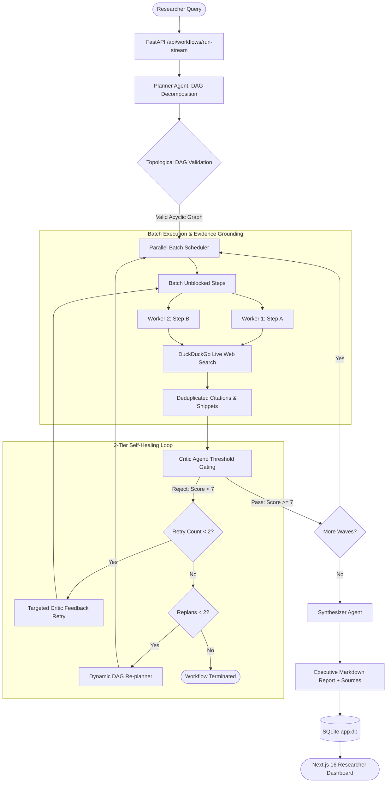

# TriadFlow: Autonomous Multi-Agent Research System

> **A Production-Grade Planner–Executor–Critic Multi-Agent Platform**  
> Powered by Google Gemini 2.5, Live Web Grounding (DuckDuckGo), Passwordless Email OTP Authentication, and an Enterprise Governance Architecture.

[](https://fastapi.tiangolo.com)
[](https://nextjs.org)
[](https://python.org)
[](https://ai.google.dev)
[](tests/)

---

## 📖 System Overview

TriadFlow is an autonomous, observable, and resilient multi-agent research framework designed to synthesize deep research deliverables from natural language user objectives. It combines:

1. **Planner Agent:** Decomposes complex research questions into structured Directed Acyclic Graphs (DAGs) with topological dependency ordering.
2. **Executor Agent:** Concurrently executes plan steps with scoped ancestor context, querying real-time web search tools and extracting source evidence.
3. **Critic Agent:** Conducts adversarial audits across numerical correctness, completeness, and relevance thresholds ($\ge 7/10$), detecting factual hallucinations and triggering bounded self-correction.
4. **Synthesizer Agent:** Aggregates validated step deliverables and deduplicated citations into an executive markdown research report.
5. **Role Governance:** Strict role segregation between **Researchers** (research execution, source citations) and **Administrators** (user registry, company workflows, token telemetry, security audit trail).
6. **Passwordless OTP Authentication:** Eliminates password vulnerabilities via 6-digit cryptographic email verification codes and disposable email platform rejection.

For full architectural blueprints, diagrams, and entry point mappings, see **[`ARCHITECTURE.md`](ARCHITECTURE.md)**.

---

## 🎯 Architecture Diagram



---

## 🧭 System Entry Points

| Layer | Entry File | Protocol / Port | Purpose |
| :--- | :--- | :--- | :--- |
| **Backend API** | [`src/api/main.py`](src/api/main.py) | HTTP / Port `8000` | FastAPI server bootstrap, CORS, router registration, OpenAPI/Swagger docs (`http://localhost:8000/docs`). |
| **Frontend Web** | [`frontend/src/app/page.tsx`](frontend/src/app/page.tsx) | HTTP / Port `3000` | Next.js 16 landing page with feature cards, direct login/signup links. |
| **Agent Triad Orchestrator** | [`src/orchestrator/engine.py`](src/orchestrator/engine.py) | Python Engine | Orchestrates Planner-Executor-Critic-Synthesizer state machine and self-correction. |
| **Researcher Dashboard** | [`frontend/src/app/dashboard/page.tsx`](frontend/src/app/dashboard/page.tsx) | Browser View | Interactive research console with live SSE streaming, 4-stage stepper, and report download. |
| **Admin Governance Console** | [`frontend/src/app/admin/page.tsx`](frontend/src/app/admin/page.tsx) | Browser View | Administrative dashboard for user management, system-wide workflows, and server audit logs. |

---

## 📁 Folder Structure

```text
OJTProject/
├── ARCHITECTURE.md                  # Comprehensive architectural reference & design decisions
├── README.md                        # Quick start guide and project overview
├── app.db                           # SQLite persistent database (Users, Workflows, OTP Codes)
├── logs/                            # Production server logs
│   ├── user_activity.log            # Server security audit trail
│   └── user_workflows.jsonl         # Structured JSONL telemetry logs
│
├── src/                             # Core Backend Source Code
│   ├── agents/                      # Specialized Agent Implementations
│   │   ├── planner.py               # Natural language goal to validated DAG
│   │   ├── executor.py              # Scoped context execution & web search grounding
│   │   ├── critic.py                # Adversarial evaluation & threshold gating
│   │   └── synthesizer.py           # Final executive report synthesis & citations
│   │
│   ├── orchestrator/                # Multi-Agent State Machine
│   │   └── engine.py                # Topological batch scheduler & recovery loops
│   │
│   ├── tools/                       # Grounding Tools
│   │   └── search.py                # DuckDuckGo live search with URL deduplication
│   │
│   ├── llm/                         # LLM Gateway
│   │   └── gateway.py               # Google Gemini (gemini-flash-lite-latest) with failover cascade
│   │
│   ├── models/                      # Pydantic v2 Data Contracts
│   │   └── schemas.py               # WorkflowState, Plan, Step, CriticReview, Citations
│   │
│   └── api/                         # FastAPI Application & Services
│       ├── main.py                  # API server entrypoint & CORS setup
│       ├── auth.py                  # Passwordless email OTP authentication & RBAC guards
│       ├── database.py              # SQLite data persistence & admin queries
│       ├── audit_logger.py          # Security audit logger
│       └── routes/                  # API Routers (/workflows, /admin)
│
├── frontend/                        # Next.js 16 Web Application
│   ├── src/app/                     # Next.js App Router (/dashboard, /admin, /login, /signup)
│   ├── src/components/              # UI components (Navbar, ThemeToggle, SettingsModal, Toast)
│   └── src/lib/                     # API client, AuthContext, ToastContext
│
└── tests/                           # Complete Pytest Test Suite (39 Tests)
    ├── test_api.py                  # API endpoints, OTP auth flow, RBAC, ownership checks
    ├── test_planner.py              # DAG generation & dependency ordering
    ├── test_executor.py             # Scoped dependency execution
    ├── test_critic.py               # Critic thresholds & failure detection
    ├── test_synthesizer.py          # Report synthesis & citations formatting
    ├── test_parallel.py             # Topological batching & parallel execution speedup
    ├── test_recovery.py             # Bounded retries & dynamic replanning
    ├── test_schemas.py              # Pydantic models & graph validation
    └── test_llm_gateway.py          # Token & cost calculation
```

---

## ⚡ Quick Start Guide

### 1. Prerequisites
- Python 3.11+
- Node.js v18+ & npm
- Google Gemini API Key ([aistudio.google.com](https://aistudio.google.com))

### 2. Backend Setup
```bash
# Clone the repository
git clone https://github.com/ASHUTOSH-SHUKLAA/Planner-Executor-Critic-Multi-Agent-System.git
cd Planner-Executor-Critic-Multi-Agent-System

# Activate Python virtual environment
.\.venv\Scripts\Activate.ps1  # Windows PowerShell
# source .venv/bin/activate    # Linux / macOS

# Install dependencies
pip install -r requirements.txt

# Configure environment variables in .env
# GEMINI_API_KEY=your_gemini_api_key_here
# JWT_SECRET=your_jwt_secret_key_here

# Launch FastAPI backend
python -m uvicorn src.api.main:app --host 0.0.0.0 --port 8000 --reload
```
API Documentation will be live at: `http://localhost:8000/docs`

### 3. Frontend Setup
```bash
cd frontend
npm install
npm run dev
```
Frontend web application will be live at: `http://localhost:3000`

---

## 🔒 Security & Role Model

### Researcher (`user`) vs Admin (`admin`)
- **Researcher:** Submits research queries, watches live multi-agent execution, reviews citations, and downloads reports.
- **Admin:** Platform compliance and governance. Has full access to `/admin` to view registered users, company-wide research workflows, token costs, and persistent server audit logs (`logs/user_activity.log`).
- **Research Execution Restriction:** To adhere to enterprise separation-of-concerns and prevent audit trail contamination, `POST /api/workflows/run-stream` strictly returns **403 Forbidden** if an administrator account attempts to execute research.

### Passwordless Email OTP Authentication
- **Step 1:** Enter authentic email address. Disposable and burner platforms (e.g. `tempmail`, `10minutemail`, `mailinator`) are rejected at the perimeter.
- **Step 2:** System generates a 6-digit cryptographic numeric OTP with 10-minute expiry and rate-limiting lockout (max 5 attempts).
- **Step 3:** User submits the code. Upon verification, the single-use code is deleted, the user is provisioned or retrieved, and a stateless JWT session token is returned.

---

## 🧪 Automated Testing

Run the full pytest suite with:
```bash
pytest tests/ -v
```
All 39 unit and integration tests run deterministically against local mock fixtures and SQLite persistence with 100% pass rate.
