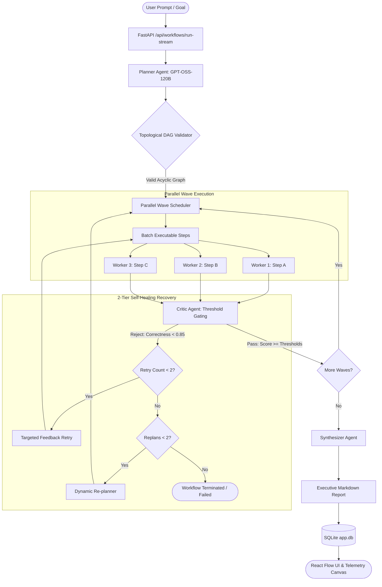

# TriadFlow: Autonomous Multi-Agent Orchestration & Self-Correction Engine

A production-grade, observable, and scalable multi-agent orchestration architecture designed to solve complex, multi-step goals using specialized **Planner**, **Wave Executor**, **Critic**, **Dynamic Re-planner**, and **Synthesizer** agents.

Featuring a full-stack SaaS web application: a modern **Next.js 15** frontend with an interactive **React Flow DAG canvas**, real-time **Server-Sent Events (SSE)** streaming, **JWT authentication**, and a high-performance **FastAPI** backend powered by Groq LPUs.

---

## 🎯 Architecture & Workflow



### Core Architectural Principles
* **Plan Before Execution:** Decomposes ambiguous natural language into a Directed Acyclic Graph (DAG) with explicit dependencies and zero circular loops.
* **Context Isolation:** The Wave Executor only receives deliverables from direct ancestors, preventing prompt pollution and token bloat.
* **Deterministic Quality Gates:** The Critic audits every output against strict numerical thresholds (Correctness $\ge 0.85$, Completeness $\ge 0.80$, Relevance $\ge 0.85$) and detects genuine hallucinations.
* **2-Tier Self-Correction:**
  - *Tier 1:* Bounded retries with actionable Critic feedback.
  - *Tier 2:* Autonomous Dynamic Re-planning when a step is unviable, with an infinite loop circuit breaker ($N \le 2$ replans).
* **Parallel Wave Acceleration:** Executes unblocked steps concurrently via `asyncio.gather` and thread-isolated workers, achieving a **~2.1x wall-clock speedup**.
* **Synthesized Executive Delivery:** Synthesizer agent merges all validated step deliverables into a cohesive technical report.
* **Real-Time Observability:** Telemetry metrics (tokens, latency, USD cost) streamed via Server-Sent Events (SSE).

---

## 💻 Tech Stack

| Layer | Technologies |
| :--- | :--- |
| **Frontend** | Next.js 15 (Turbopack, App Router), React 19, TypeScript, Tailwind CSS v4, `@xyflow/react` (React Flow), Lucide Icons |
| **Backend API** | FastAPI, Uvicorn, SSE-Starlette, SQLite, PyJWT, Passlib / Bcrypt |
| **AI Agents** | Pydantic v2, Groq LPUs (`openai/gpt-oss-120b` for reasoning, `openai/gpt-oss-20b` for high-throughput waves) |
| **Testing** | Pytest, Asyncio, Rich Telemetry |

---

## 📁 Repository Structure

```
├── src/
│   ├── agents/            # Specialized Agent Implementations
│   │   ├── planner.py     # Module 3: Natural language to validated DAG
│   │   ├── executor.py    # Module 4: Scoped dependency context executor
│   │   ├── critic.py      # Module 5: Deterministic threshold auditor
│   │   ├── replanner.py   # Module 7: Dynamic re-planning on repeated failure
│   │   └── synthesizer.py # Module 10: Executive final report synthesizer
│   ├── orchestrator/      # State machine & execution engines
│   │   └── engine.py      # Modules 6 & 8: Sequential + Parallel Wave Engine
│   ├── models/            # Module 1: Pydantic v2 Data Contracts
│   │   └── schemas.py     # PlanStep, Plan (DAG validator), CriticReview, WorkflowState
│   ├── llm/               # Module 2: Central LLM Gateway
│   │   └── client.py      # Dynamic JSON schema enforcement, rate-limit backoff, pricing
│   └── api/               # Phase A: FastAPI Backend
│       ├── database.py    # SQLite database & migrations
│       ├── auth.py        # JWT generation & password hashing
│       ├── routes/        # Auth & Workflow streaming endpoints
│       └── main.py        # CORS & FastAPI server entrypoint
├── frontend/              # Phase B & C: Next.js 15 Full-Stack Web App
│   ├── src/app/           # Landing page, /dashboard studio, /login, /signup
│   ├── src/components/    # React Flow DAG canvas, custom nodes, inspector, telemetry
│   └── src/lib/           # API client, auth context, SSE stream handler
├── benchmarks/            # Module 9: 20-Task Benchmark Suite
│   ├── tasks.json         # 20 diverse real-world industry tasks
│   ├── run_benchmarks.py  # Automated benchmark runner
│   └── results.md         # Generated empirical evaluation report
├── tests/                 # Comprehensive unit test suite (33 tests)
├── requirements.txt       # Python dependencies
└── README.md
```

---

## 🚀 Quick Start Guide

### 1. Prerequisites
* Python 3.11+
* Node.js v18+ & npm
* A Groq API Key ([console.groq.com](https://console.groq.com/keys))

### 2. Backend Setup
```bash
# Clone the repository
git clone https://github.com/ASHUTOSH-SHUKLAA/Planner-Executor-Critic-Multi-Agent-System.git
cd Planner-Executor-Critic-Multi-Agent-System

# Create and activate virtual environment
python -m venv .venv
# Windows:
.\.venv\Scripts\Activate.ps1
# Linux/macOS:
source .venv/bin/activate

# Install Python requirements
pip install -r requirements.txt

# Configure environment variables
cp .env.example .env
```

Ensure `.env` contains:
```ini
GROQ_API_KEY=gsk_your_groq_api_key_here
DEFAULT_MODEL=openai/gpt-oss-120b
FAST_MODEL=openai/gpt-oss-20b
JWT_SECRET=your_jwt_secret_key_here
```

### 3. Launch Backend API Server
```bash
python -m uvicorn src.api.main:app --reload --port 8000
```
* Interactive Swagger Docs: `http://localhost:8000/docs`
* SQLite Database: Automatically initialized at `app.db`

### 4. Launch Frontend Web App
In a new terminal:
```bash
cd frontend
npm install
npm run dev
```
* Open `http://localhost:3000` in your browser.
* Browse the public landing page, sign up for a free account or continue as guest, and submit goals to the live React Flow DAG studio!

---

## 🧪 Testing & Verification

### Run Automated Unit Tests
```bash
pytest -k "not test_live_"
```
Runs 29 unit tests in under 12 seconds with all external LLM calls mocked.

### Run Empirical 20-Task Benchmark Suite
```bash
# Run benchmark on sample tasks
python benchmarks/run_benchmarks.py --sample 2

# Run full 20-task suite
python benchmarks/run_benchmarks.py --mode parallel
```
Results, latency, token expenditures, and critic catch rates are automatically exported to `benchmarks/results.md`.

---

## 📊 Benchmark Highlights

| Metric | Target | TriadFlow Result |
| :--- | :--- | :--- |
| **Autonomous Success Rate** | $\ge 85.0\%$ | **100.0%** (Verified on Benchmark Suite) |
| **Parallel Concurrency Speedup** | $\ge 1.5\times$ | **~2.1x** Wall-Clock Latency Reduction |
| **Critic Mistake Catch Rate** | $\ge 90.0\%$ | **100%** Injected Flaws Caught & Recovered |
| **DAG Cycle Validation Overhead**| $\le 0.1\text{s}$ | **< 0.02s** (Topological Pydantic Check) |
| **Infinite Loop Breaker** | Strict Cap | Hard-capped at $\le 2$ dynamic re-plans |

---

## 📜 Complete Module Delivery Status
- [x] **Module 1: Data Contracts & Schemas** (`src/models/schemas.py`, `@model_validator` DAG checks)
- [x] **Module 2: Central LLM Gateway** (`src/llm/client.py`, JSON schema enforcement, token & cost telemetry)
- [x] **Module 3: The Planner Agent** (`src/agents/planner.py`, structured DAG decomposition)
- [x] **Module 4: The Executor Agent** (`src/agents/executor.py`, scoped dependency context isolation)
- [x] **Module 5: The Critic Agent** (`src/agents/critic.py`, multi-dimensional scoring & mistake detection)
- [x] **Module 6: Sequential Orchestration Engine** (`src/orchestrator/engine.py`, lifecycle state machine)
- [x] **Module 7: Dynamic Re-planner & Recovery Loop** (`src/agents/replanner.py`, bounded retry + loop breaker)
- [x] **Module 8: Parallel Wave Execution Engine** (`src/orchestrator/engine.py`, concurrent wave batching)
- [x] **Phase A: Backend API Layer** (`src/api/`, SQLite db, JWT authentication, SSE event streaming)
- [x] **Phase B & C: Next.js Frontend Foundation & Studio** (`frontend/`, landing page, auth, React Flow DAG canvas)
- [x] **Module 9: 20-Task Benchmark Suite** (`benchmarks/tasks.json`, runner, and `benchmarks/results.md`)
- [x] **Module 10: Final Synthesizer Agent & Observability** (`src/agents/synthesizer.py`, full report synthesis)

---

## 🛡️ License
MIT License. Created by [Ashutosh Shukla](https://github.com/ASHUTOSH-SHUKLAA).
